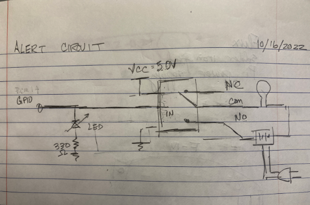
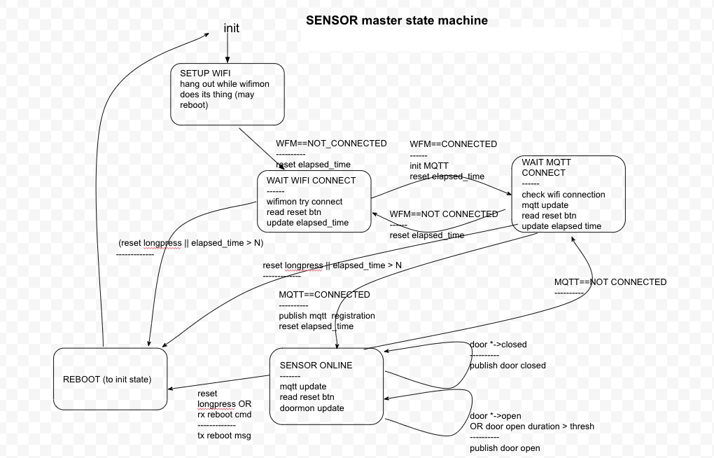
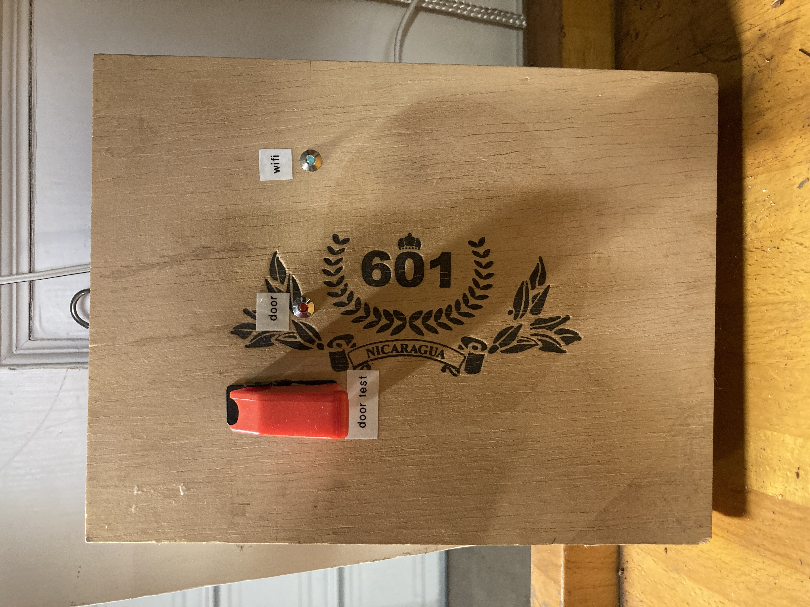

DOOR
----

DOOR is a Wifi-enabled garage door sensor

We have a detached garage, and occasionally the garage door is left open or re-opens on its own. That's why I built DOOR, a remote garage-door sensor. 

DOOR monitors the state of the garage door and publishes  updates via Wi-Fi to a [MQTT broker](https://mosquitto.org/) in my house.  Another system I built, [AlertBot](https://github.com/robyu/alertbot), subscribes to DOOR updates. AlertBot sits in my kitchen and loudly announces when the garage door opens, closes, or has been left open.

DOOR's hardware is built around an [ESP8266](https://en.wikipedia.org/wiki/ESP8266), a Wi-Fi enabled microcontroller which is compatible with the Arduino toolset. The actual sensor is a reed switch connected to a GPIO pin; a beefy magnet on the garage door activates the reed switch.

The firmware is written in C, using [platformio](https://platformio.org/).

The state machine is surprisingly complex, primarily because it has to deal with the details of Wi-Fi setup and connection, as well as reset commands.

After developing and testing DOOR on a protoboard, I soldered it onto a breadboard and shoved the whole thing into a cigar box. It ain't pretty, but it works.

Detailed Documentation

https://docs.google.com/document/d/1rnizVCsxLXGlfpaVHpRxiN8h5cO-BPx0BfrcB0WDp4A/edit?usp=sharing

License
=======

MIT License
